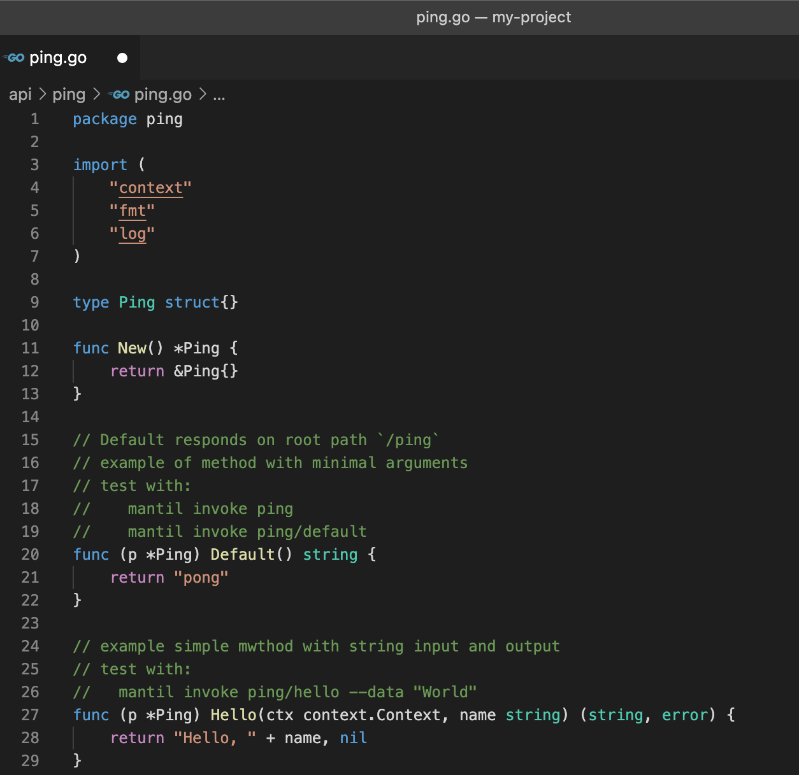
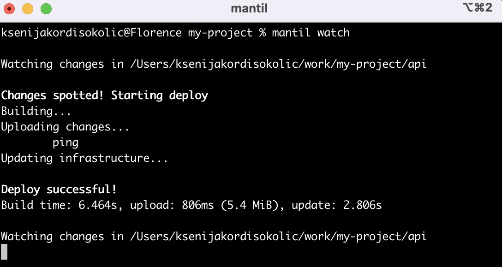

[![License][License-Image]][License-Url]  [](https://codecov.io/gh/mantil-io/mantil)

[License-Url]: https://github.com/mantil-io/mantil/blob/master/LICENSE
[License-Image]: https://img.shields.io/badge/license-MIT-blue

# Serverless development kit for Go and AWS Lambda

Cloud-native development demands a new approach to building, launching, and observing cloud apps. [Mantil](https://www.mantil.com) is a modern open-source framework for writing serverless apps in Go. It allows you to quickly create and deploy applications that use AWS Lambda over a command line interface.

## About Mantil
### 🧑‍💻 Tailored for developers
There are many serverless tools out there focused on building infrastructure. In Mantil, developers write pure Go code without any notion of AWS or Lambda. Therefore, you don't need an upfront understanding of the complex AWS ecosystem and tooling.

<p align="center">

<p/>

### ☁️ Cloud environments
Get the feeling of local development while using real services in the cloud. With built-in support for multiple development stages and parallel lines of deployment, you still keep your private development sandbox. But in the serverless world, all environments are essentially the same environments. 

### 🤩 Continuous deployment
Many developers who have played with AWS Lambda complain about frustrating build experiences where you need to make a number of steps manually. With **mantil watch** app is deployed automatically on every save. Moreover, it is done in seconds, so fluid development workflow is preserved.

<p align="center">

<p/>

Mantil also supports **code testing** via standard go tests or by invoking a specific function and **getting logs instantly** during function execution (not after the function is completed). And much more. 


## Quick Start
To get started with Mantil, you need to have installed Go and access to AWS account. Follow these few simple steps, and you will be up and running in minutes. 

```
# Install Mantil CLI
$ brew tap mantil-io/mantil
$ brew install mantil

# Install Mantil Node on AWS
$ mantil aws install --aws-profile=my-named-profile

# Create your first Mantil project (it just creates project structure)
$ mantil new my-project
$ cd my-project

# Deploy your project to development stage
$ mantil stage new development
```
And that's it, you've created your first serverless app using Mantil. 
Read [Getting Started](https://docs.mantil.com/getting_started) tutorial or watch the [accompanying video](https://www.youtube.com/watch?v=Fp64VgSLoTQ) to dive deep into each step and to learn more about how to work with Mantil. 

Mantil CLI is also available on Windows and Linux via [direct download](https://docs.mantil.com/cli_install#direct-download-linux-windows-and-mac). 


## Documentation
Check out [documentation](https://docs.mantil.com) to get into specific areas of Mantil:
* familiarize yourself with [General Concepts](https://docs.mantil.com/concepts/node)
* learn more about [testing principles](https://docs.mantil.com/Usage/testing)
* find out how to configure environment variables, scheduled execution, private API's or custom domain in [API Configuration](https://docs.mantil.com/api_configuration/env_variables)
* get an overview of all available [CLI commands](https://docs.mantil.com/commands/overview)


## Examples
Choose from among several guided tutorials that will give you step-by-step examples of various features of Mantil:
* [Chat](https://github.com/mantil-io/template-chat) - demonstrates WebSocket Mantil API interface
* [Todo](https://github.com/mantil-io/template-todo) - simple todo app showcasing persistent key/value storage
* [Signup](https://github.com/mantil-io/example-signup) - example of simple signup workflow
* [Excuses](https://github.com/mantil-io/template-excuses) - UI and environment variables showcase
* [Github to Slack](https://github.com/mantil-io/template-github-to-slack) - example of serverless integration between GitHub and Slack
* [HN alerts](https://github.com/mantil-io/example-hn-alerts) - example of scheduled lambda function that will look for new HackerNews stories containing certain keywords
* [Mongo Atlas](https://github.com/mantil-io/example-mongo-atlas) - example of using Mantil with Mongo Atlas
* [Presigned s3 upload](https://github.com/mantil-io/template-presigned-s3-upload) - template showing upload of files to S3 bucket through presigned URLs
* [NGS chat](https://github.com/mantil-io/example-ngs-chat) - example of chat implemented with [NATS](https://github.com/nats-io)

## Feedback 
We'd love to hear from you. If you would like to getting in touch DM us on [Twitter @MantilDev](https://twitter.com/MantilDev).

#
<p align="center"> ⭐️ If you like Mantil, give it a star! ⭐️</p>


